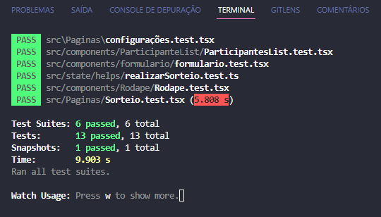
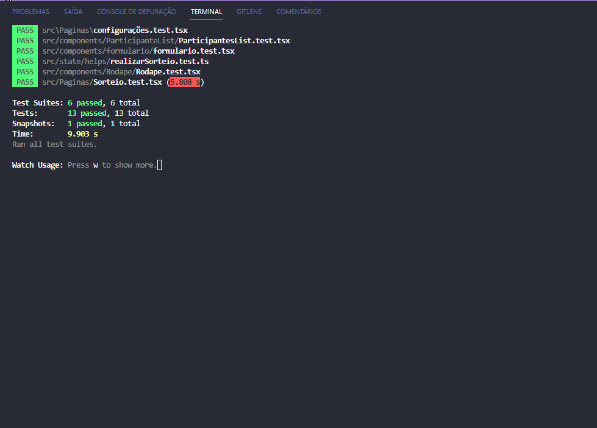

## Test desenvolvimento TDD

Está aplicação foi construida com desenvolvimentod e testes em TDD, onde a página de sorteio teve os componentes e a lógica de teste criadas primeiramente antes de ser executado.

projeto tem como foco testes que foram aplicado para este desenvolvimento.

Foram realizados no tal 6 grupos 
com no total 13 testes todos com status passados.

#### Feito com :heart: por Wang Kai

